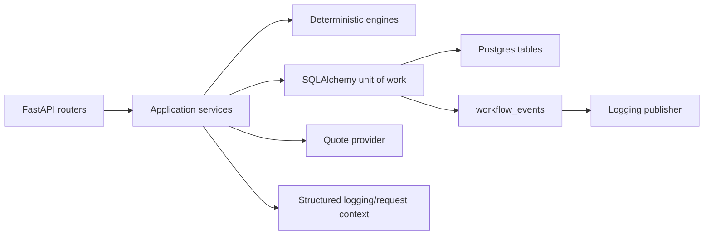

# OddsExecutionEngine - System Architecture and State/Data Flow

This document describes the current backend shape as implemented today, following how state enters the system, where it is normalized, how it is persisted, and how it is reused across recommendation, watch, and opportunity workflows.

For the stage-specific watch/opportunity deep dive, see `docs/architecture/stages-5-6-data-flows.md`.

## Runtime Shape

Main wiring lives in `backend/app/main.py`.

## Layer Ownership

| Layer | Owns | Does not own |
| --- | --- | --- |
| `api` | HTTP validation, transport mapping, status codes | business rules, persistence details |
| `application` | workflow orchestration, transaction boundaries, service-to-service coordination | pricing logic, raw SQL shape |
| `domain` | immutable models and event payload shapes | I/O, framework behavior |
| `engines` | deterministic matching, ranking, fillability, watch evaluation, validity checks | DB reads, HTTP calls |
| `infrastructure` | DB sessions, SQLAlchemy tables/UoWs, provider adapters, publishers, logging | business decisions about price or matching |

The cleanest part of the design is that price and match behavior stay in pure engines while application services decide when to call them.

## State Ownership

| State | Current owner | Why it exists | Main readers |
| --- | --- | --- | --- |
| `events` | ingestion UoW | canonical event identity + metadata | ingestion, watch filtering |
| `event_participants` | ingestion UoW | normalized participant list for team/prop expansion later | read models later, event detail views |
| `markets` | ingestion UoW | canonical market identity per event/selection/line | recommendations, watch evaluation |
| `market_quotes_latest` | ingestion UoW | fast current-state read path | recommendation, watch evaluation, validity checks |
| `market_quotes_history` | ingestion UoW | append-only audit/history | future analytics, replay/backtesting |
| `order_intents` | recommendation UoW | submitted execution requests | audit, future user history |
| `execution_recommendations` | recommendation UoW | persisted result snapshot | audit, future read APIs |
| `watch_intents` | watch UoW | persistent monitoring targets | watch APIs, post-ingestion evaluation |
| `opportunities` | watch UoW | immutable detection snapshots | opportunity listing, future alert delivery |
| `workflow_events` | all UoWs | append-only durable event log | audit, future outbox/consumers |

Two design choices matter most here:

1. `market_quotes_latest` and `market_quotes_history` are intentionally split.
2. `workflow_events` is written in the same transaction as business state, then published after commit.

That gives fast reads now and a clean outbox path later.

## End-to-End Flows

### 1. Recommendation Request

`POST /execution/recommendation`

1. Router validates request and builds `OrderIntent`.
2. `RecommendationService` opens `SqlAlchemyRecommendationUnitOfWork`.
3. UoW writes `order_intents`.
4. UoW reads latest quotes by joining `events -> markets -> market_quotes_latest`.
5. `QuoteMatchingEngine` filters exact market identity matches.
6. `RecommendationEngine` ranks quotes, computes fillable/best/nearest miss.
7. UoW writes `execution_recommendations`.
8. Service stages `OrderIntentSubmitted` and `ExecutionRecommendationGenerated`.
9. On successful `__exit__`, UoW writes staged rows into `workflow_events`, commits, then publisher logs them.

Important property: recommendation reads only latest quote state; history is not on the hot path.

### 2. Single Event Quote Refresh

`POST /ingestion/quotes/refresh`

1. `QuoteIngestionService` fetches provider quotes for one event.
2. `NormalizationEngine` drops malformed or mismatched quotes and preserves only canonical `Quote` values.
3. `SqlAlchemyQuoteIngestionUnitOfWork`:
   - upserts/refreshes event metadata
   - refreshes participants
   - ensures canonical market rows
   - rewrites `market_quotes_latest` per market/sportsbook
   - appends `market_quotes_history`
4. Service stages `MarketSnapshotCreated`, `QuoteUpdated`, and batch-level `QuotesRefreshed`.
5. Commit persists both state and workflow events together.
6. After commit, publisher logs events.
7. After publish, `WatchIntentService.evaluate_for_event()` runs as a best-effort follow-up to detect new opportunities.

Important property: opportunity creation is not part of the ingestion transaction. It is a second workflow triggered after a successful quote commit.

### 3. Sport-Level Refresh

`POST /ingestion/quotes/refresh-sport`

1. Provider fetches all configured events for one sport.
2. Service loops event-by-event.
3. Each event executes the single-event refresh flow above.
4. Each event may trigger its own watch evaluation pass.

This is operationally simple, but it means sport refresh cost scales roughly with:

- number of events in the sport
- number of quotes per event
- number of active watch intents on those events

### 4. Watch Intent Creation and Evaluation

`POST /watch-intents`

1. Router validates market shape.
2. `WatchIntentService` writes `watch_intents`.
3. Same request immediately reads latest quotes for the event.
4. `WatchEvaluationEngine` matches active intent vs exact market identity and fillable price.
5. Candidate `opportunities` are inserted idempotently.
6. Only rows that actually insert produce `OpportunityIdentified`; duplicate identities are ignored without extra events.
7. `WatchIntentCreated` and inserted-only `OpportunityIdentified` events are staged and committed.

Important property: watch creation does immediate evaluation against current state, so the API can produce opportunities without waiting for the next refresh.

### 5. Opportunity Listing

`GET /opportunities`

1. Watch UoW reads persisted `opportunities` plus watch metadata.
2. It then looks up latest quote timestamps for each opportunity.
3. `OpportunityValidityEngine` computes whether each snapshot is still actionable:
   - expired by TTL
   - quote removed
   - quote superseded by newer quote

Important property: opportunities are immutable snapshots. Validity is computed at read time, not updated in place.

## Current Design Strengths

### Deterministic core is in the right place

Matching, ranking, fillability, and opportunity detection are testable without infrastructure. This keeps the hardest logic stable as provider count grows.

### Transaction boundary is explicit

Each UoW owns one write boundary and stages workflow events inside it. That is a strong base for moving to a durable outbox later without rewriting service logic.

### Data model matches product intent

- recommendation reads latest market state
- history tables preserve auditability
- opportunities are snapshots instead of mutable alerts
- watch intents remain separate from detected opportunities

## Current Bottlenecks and Things To Fix Now

### 1. Quote ingestion is row-by-row and query-heavy

Current flow does `SELECT market`, then `DELETE latest`, then `INSERT latest`, then `INSERT history` for each quote.

Why this matters now:

- fine for fixtures and modest sports
- expensive once a sport refresh contains many events/books/markets
- creates more lock churn than an upsert-based path

Recommended next step:

- replace delete+insert latest writes with native Postgres upserts
- batch market lookup and quote writes per event
- handle unique-conflict retry around market creation

### 2. Post-refresh watch evaluation is best-effort, not durable

Quote ingestion commits first, then calls `WatchIntentService.evaluate_for_event()` outside the transaction and swallows failures into logs.

Why this matters now:

- quote refresh can return success while opportunity detection quietly fails
- replay/recovery is manual
- current dependency is a direct service call instead of a formal application port

Recommended next step:

- formalize a post-commit workflow contract around watch evaluation
- move toward durable outbox/job execution before adding more downstream consumers

### 3. Read paths already have N+1 patterns

Current examples:

- `list_opportunities()` reads opportunity rows, then `get_latest_quote_times()` queries one-by-one
- `list_watch_intents()` loads intents, then checks event start times per event id

Why this matters now:

- watch/opportunity reads are still small, but this will degrade quickly once many intents exist

Recommended next step:

- batch quote-time reads with one query
- push event start filtering into SQL joins where possible

### 4. Single-event live refresh is provider-expensive

`TheOddsApiProvider.list_quotes(event_id)` searches configured sports and fetches each sport feed until it finds the event.

Why this matters now:

- burns API quota faster than necessary
- increases latency for event-specific refresh
- gets worse as configured sports expand

Recommended next step:

- persist enough event-to-sport/provider metadata to route directly
- or use provider-native event endpoints if/when available

### 5. Test strategy is stronger in docs than in automation

The repo correctly documents Postgres as the truth path, but most fast coverage is SQLite smoke coverage plus one optional Postgres-gated test.

Why this matters now:

- the hottest logic is SQL-heavy and Postgres-specific behavior will matter more as upserts/indexes/locking get added

Recommended next step:

- add more mandatory Postgres integration coverage for ingestion, watch evaluation, and duplicate protection

## What Will Matter Next As Scale Increases

### Durable event delivery

`workflow_events` is already close to an outbox. The next scale step is not a bigger publisher; it is a poller/worker that can safely resume failed downstream work.

### Indexing and retention strategy

`workflow_events` and `market_quotes_history` will grow fastest. Add explicit indexes before building heavy read APIs, then plan retention/partitioning once history volume becomes meaningful.

### Read models for monitoring

If opportunities become user-facing alerts, read-time validity recomputation will get expensive. A denormalized read model or materialized validity state may become necessary.

### Multi-provider canonicalization

Current canonical quote mapping is intentionally minimal. That is correct for one live provider, but cross-provider event identity, participant normalization, and player-prop support will need a stronger normalization layer.

### Concurrency control

The opportunity path now has DB-enforced identity protection. As refresh jobs, async consumers, or multiple API replicas appear elsewhere, the same pattern should be extended to other write paths that still rely mainly on in-process coordination.

### Operational backpressure

Sport refreshes, watch evaluation, and external quota management are currently coupled. As more sports/providers are enabled, rate limiting, scheduling, and retry policy need to move into explicit infrastructure instead of inline request-time loops.

## Recommended Near-Term Sequence

1. Replace ingestion delete+insert behavior with Postgres upserts and batched writes.
2. Convert post-refresh watch evaluation into a durable outbox-driven follow-up.
3. Expand mandatory Postgres integration coverage around ingestion and watch workflows.
4. Introduce richer provider normalization only when a second live provider or props workflow actually lands.

## Practical Summary

Current architecture is in a good place for the project stage:

- deterministic logic is separated cleanly
- latest vs history state split is correct
- event persistence boundary is explicit
- API layer is still thin

The biggest immediate risk is no longer duplicate opportunity creation; that path is now protected by both application prefiltering and DB uniqueness. The next highest risk is durable follow-up work after quote refresh, followed by ingestion efficiency at larger sport sizes.
