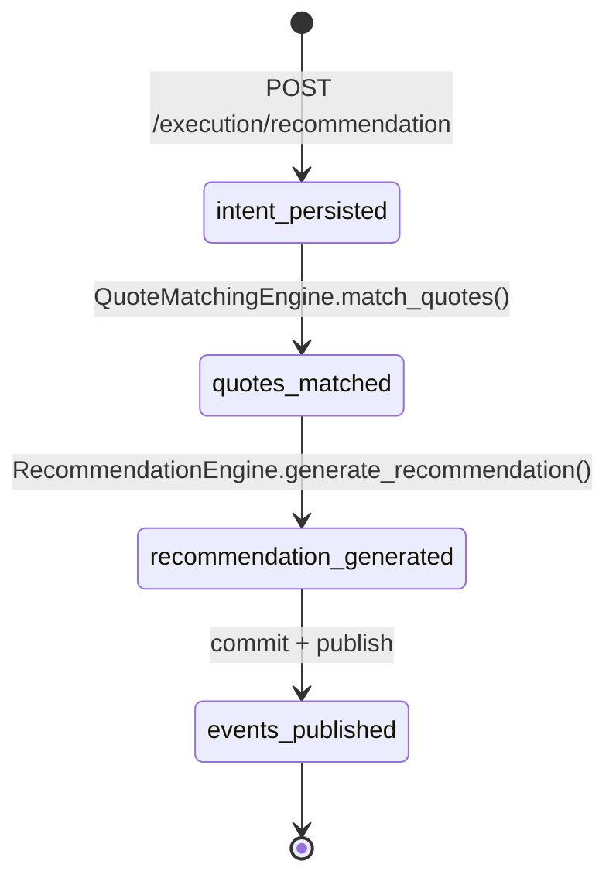

# Execution recommendation

Last updated: 2026-08-25
Updated by: claude-code

## Trigger

Client sends `POST /execution/recommendation` with event_id, market_type, selection, target_price, and optional line. The router constructs an [[OrderIntent]] and delegates to [[RecommendationService]].

## Services involved

| Service | Role | Entry point |
|---|---|---|
| [[RecommendationService]] | Orchestrates the full recommendation workflow | `backend/app/application/recommendation_service.py:recommend()` |
| [[SqlAlchemyRecommendationUnitOfWork]] | Persists intent + recommendation, reads quotes, stages events | `backend/app/infrastructure/persistence/recommendation_uow.py` |
| [[QuoteMatchingEngine]] | Filters available quotes to those matching intent criteria | `backend/app/engines/quote_matching_engine.py:match_quotes()` |
| [[RecommendationEngine]] | Ranks matched quotes and evaluates fillability | `backend/app/engines/recommendation_engine.py:generate_recommendation()` |
| [[PriceComparisonService]] | Determines if a quote price meets target | `backend/app/engines/price_comparison_engine.py:is_price_fillable()` |
| [[LoggingWorkflowEventPublisher]] | Publishes events after successful commit | `backend/app/infrastructure/publishers/logging_publisher.py:publish()` |

## State changes

| Step | From state | To state | Where | Why |
|---|---|---|---|---|
| 1 | (none) | intent_persisted | RecommendationUoW | Order intent row created, OrderIntentSubmitted event staged |
| 2 | intent_persisted | quotes_matched | QuoteMatchingEngine | Available quotes filtered by event, market_type, selection, line |
| 3 | quotes_matched | recommendation_generated | RecommendationEngine | Quotes ranked, fillability determined, best/nearest-miss identified |
| 4 | recommendation_generated | events_published | LoggingWorkflowEventPublisher | Events published only after UoW commit |



## Data flow

```mermaid
graph LR
    A[RecommendationRouter] -->|OrderIntent| B[RecommendationService]
    B -->|OrderIntent| C[RecommendationUoW]
    C -->|order_intent_id| B
    C -->|list[Quote]| B
    B -->|OrderIntent, list[Quote]| D[QuoteMatchingEngine]
    D -->|list[Quote] matched| B
    B -->|OrderIntent, list[Quote]| E[RecommendationEngine]
    E -->|ExecutionRecommendation| B
    B -->|ExecutionRecommendation| C
    C -->|recommendation_id| B
    B -->|tuple[WorkflowEvent]| F[LoggingWorkflowEventPublisher]
```

## Key decisions

- [[2026-08-25-persist-and-publish-after-commit]] — Events persisted in same transaction, published only after commit
- Fillability is `price >= target_price` (simple threshold, no spread or vig model)
- Ranking is by highest price, then alphabetical sportsbook as tiebreaker

## Issues & risks

| ID | Severity | Category | Description | Status |
|---|---|---|---|---|
| ISSUE-001 | 🟡 moderate | stale data | Quotes read from DB may be arbitrarily stale — no freshness check before recommendation | open |
| ISSUE-002 | 🟢 low | performance | All quotes for event loaded then filtered in-memory; no DB-level market_type/selection filter | open |

## Deeplinks

- Model: `backend/app/domain/models.py` (OrderIntent, ExecutionRecommendation, Quote)
- Core logic: `backend/app/application/recommendation_service.py:32-97`
- Matching: `backend/app/engines/quote_matching_engine.py:5-13`
- Ranking: `backend/app/engines/recommendation_engine.py:9-44`
- Price comparison: `backend/app/engines/price_comparison_engine.py:2-4`
- Persistence: `backend/app/infrastructure/persistence/recommendation_uow.py:66-117`
- Events: `backend/app/domain/events.py:97-134` (build_order_intent_submitted_event, build_execution_recommendation_generated_event)
- Test: `backend/tests/test_engines.py`, `backend/tests/test_events.py`
- API endpoint: `POST /execution/recommendation` → `backend/app/api/recommendation_router.py`
- Related flow: [[quote-ingestion-refresh]]
