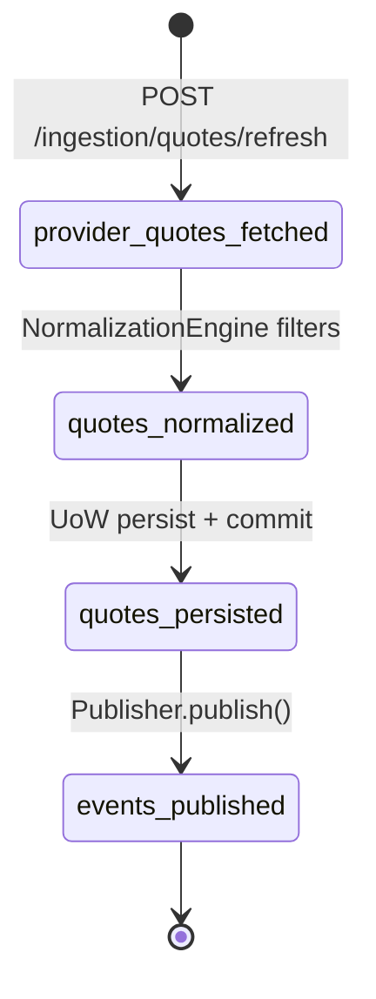

# Quote ingestion refresh

Last updated: 2026-08-25
Updated by: claude-code

## Trigger

Client sends `POST /ingestion/quotes/refresh` with a JSON body containing `event_id`. The router delegates to [[QuoteIngestionService]].

## Services involved

| Service | Role | Entry point |
|---|---|---|
| [[QuoteIngestionService]] | Orchestrates the full refresh workflow | `backend/app/application/quote_ingestion_service.py:refresh_quotes()` |
| [[InMemoryQuoteProvider]] | Supplies raw quotes for the given event | `backend/app/infrastructure/quote_provider.py:list_quotes()` |
| [[NormalizationEngine]] | Filters invalid quotes and enforces canonical shape | `backend/app/engines/normalization_engine.py:normalize_quotes()` |
| [[SqlAlchemyQuoteIngestionUnitOfWork]] | Persists quotes and workflow events in a single transaction | `backend/app/infrastructure/persistence/quote_ingestion_uow.py:persist_quotes()` |
| [[LoggingWorkflowEventPublisher]] | Publishes events after successful commit | `backend/app/infrastructure/publishers/logging_publisher.py:publish()` |

## State changes

| Step | From state | To state | Where | Why |
|---|---|---|---|---|
| 1 | (none) | provider_quotes_fetched | QuoteIngestionService | Raw quotes retrieved from provider for the event |
| 2 | provider_quotes_fetched | quotes_normalized | NormalizationEngine | Invalid quotes filtered (wrong event, bad selection, missing line) |
| 3 | quotes_normalized | quotes_persisted | QuoteIngestionUoW | Upsert latest, append history, ensure event/market rows |
| 4 | quotes_persisted | events_published | LoggingWorkflowEventPublisher | Workflow events published only after DB commit succeeds |



## Data flow

```mermaid
graph LR
    A[QuoteIngestionRouter] -->|event_id| B[QuoteIngestionService]
    B -->|event_id| C[InMemoryQuoteProvider]
    C -->|list[Quote]| B
    B -->|event_id, list[Quote]| D[NormalizationEngine]
    D -->|list[Quote] filtered| B
    B -->|event_id, list[Quote]| E[QuoteIngestionUoW]
    E -->|QuoteRefreshPersistenceResult| B
    B -->|tuple[WorkflowEvent]| F[LoggingWorkflowEventPublisher]
```

## Key decisions

- [[2026-08-25-persist-and-publish-after-commit]] — Events persisted in same transaction, published only after commit
- [[2026-08-25-latest-plus-history-persistence]] — Separate latest and history tables for reads vs audit

## Issues & risks

| ID | Severity | Category | Description | Status |
|---|---|---|---|---|
| ISSUE-001 | 🟡 moderate | no idempotency | Repeated refresh for same event_id appends duplicate history rows with no deduplication | open |
| ISSUE-002 | 🟡 moderate | no retry | Provider fetch has no retry/backoff; transient failure fails the entire request | open |
| ISSUE-003 | 🟡 moderate | concurrency | No lock on market upsert — concurrent refreshes for same event could race on market creation | open |
| ISSUE-004 | 🟢 low | hardcoded config | InMemoryQuoteProvider uses hardcoded fixture data; no configuration for provider switching | open |
| ISSUE-005 | 🟢 low | missing validation | No staleness check on quotes — stale provider data is persisted without age verification | open |

## Deeplinks

- Model: `backend/app/domain/models.py` (Quote, PersistedQuote, QuoteRefreshPersistenceResult, QuoteRefreshSummary)
- Core logic: `backend/app/application/quote_ingestion_service.py:34-108`
- Persistence: `backend/app/infrastructure/persistence/quote_ingestion_uow.py:67-120`
- Normalization: `backend/app/engines/normalization_engine.py:5-22`
- Events: `backend/app/domain/events.py:137-194` (build_quotes_refreshed_event, build_quote_updated_event, build_market_snapshot_created_event)
- Test: `backend/tests/test_quote_ingestion.py`
- API endpoint: `POST /ingestion/quotes/refresh` → `backend/app/api/quote_ingestion_router.py`
- Related flow: [[execution-recommendation]]
